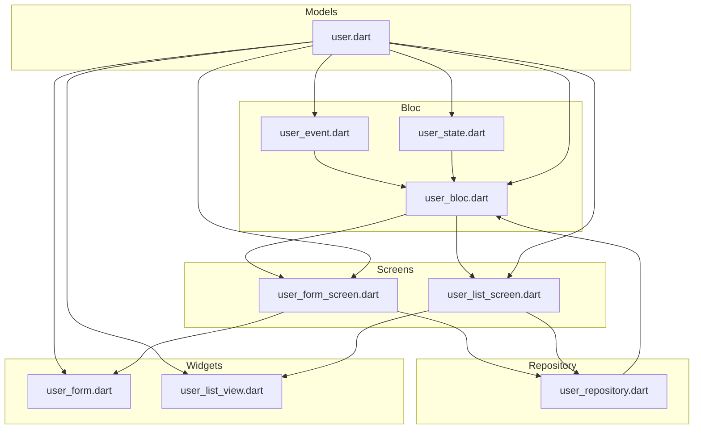

```mermaid
graph TD
    subgraph Bloc
        A[user_bloc.dart]
        B[user_event.dart]
        C[user_state.dart]
    end

    subgraph Models
        D[user.dart]
    end

    subgraph Repository
        E[user_repository.dart]
    end

    subgraph Screens
        F[user_form_screen.dart]
        G[user_list_screen.dart]
    end

    subgraph Widgets
        H[user_form.dart]
        I[user_list_view.dart]
    end

    %% Repository
    E --> A
    
    %% Bloc
    B --> A
    C --> A
    A --> G
    A --> F
    
    %% Models
    D --> A
    D --> B
    D --> C
    D --> F
    D --> G
    D --> H
    D --> I
    
    %% Screens to Widgets
    F --> H
    G --> I
    
    %% Screens to Repository
    F --> E
    G --> E

```